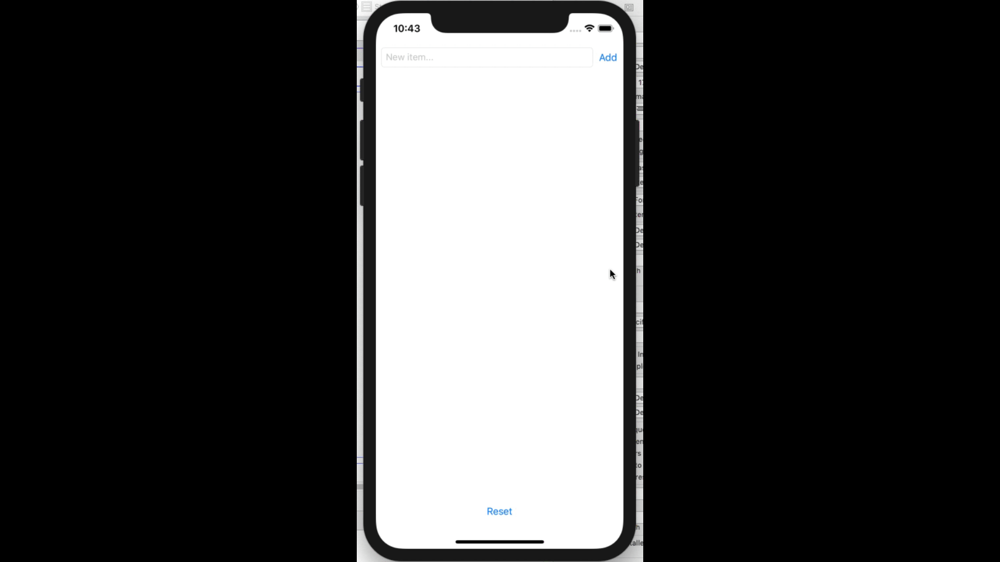
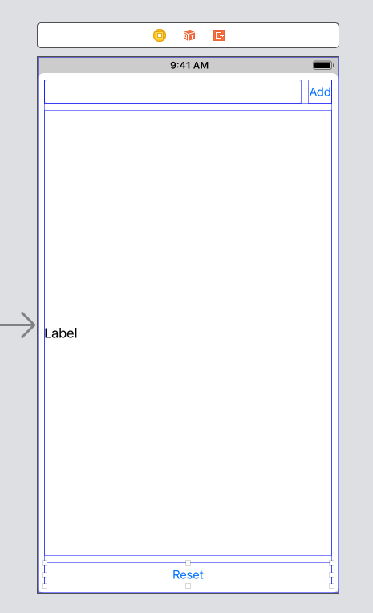

# Module Challenge: View Controllers and the Model-View-Controller Design Pattern - List

This challenge allows you to practice the concepts and techniques learned in today's guided lesson and apply them in a concrete project. Your lesson explored the view controller, IB's object library, and Model-View-Controller. You will demonstrate proficiency by creating an application that showcases the same features you learned in class.

## Instructions

**Read these instructions carefully. Understand exactly what is expected _before_ starting this Challenge.**

This is an individual assessment but you are permitted to consult with and support other members of your cohort. You are encouraged to follow the twenty-minute rule and seek support from your PM and Instructor in your cohort help channel on Slack. 

## Commits

Commit your code regularly and meaningfully. This helps both you (in case you ever need to return to old code for any number of reasons) and your project manager.

## Description

In this challenge, you build a list of items. These items can be anything you need to keep track of: things to do, things to buy, or a list of your children or pets.

Your completed application will look like the following GIF:



## Questions

Demonstrate your understanding of today's concepts by answering the following free-form questions. Submit them as a text file along with your project.

* What is Interface Builder's object library?
* What is the difference between an outlet and an action?
* What is the role of a View Controller?
* What is Model-View-Controller?
* Why use Model-View-Controller?


## Project Setup

Follow these steps to set up your project:

- Create a new Single View application. Clean up the boilerplate in the application delegate and custom View Controller class.
- Add a new Model.swift file to your project with the following contents:

```
class Model {
    static let shared = Model()
    private init() {}
    
    private(set) var items: [String] = []
}
```

## Building your Model

- Add a method to add a new item to your list. You must complete this method so it adds a new item.

```
func add(_ item: String) {
    // add the item to your items list
}
```

- Add a method that resets your list. You must complete this method too.

```
func resetItems() {
    // reset your items list here
} 
```

## Building your Interface

Follow these steps in IB to lay out your interface

- Drag a button and a text field into interface builder, with the button to the right. Embed these items into a stack view. 
- Use the attributes inspector to set the stack view spacing to 8.
- Drag in a label and another button. Make a vertical stack including your first label/button stack, then the label, then the other button.
- Use the attributes inspector to set the stack view spacing to 8 and the alignment to Fill.
- With the stack view still selected, use the Tie Fighter to set offsets to 8 above, to the left, to the right, and below. Add all four constraints.
- Select the label from the document overview. In the attributes inspector, set the number of lines from 1 to 0.
- Select the bottom button from the document overview. Open the size inspector (View > Inspectors > Show Size Inspector). Locate the vertical content hugging priority. Set it to 1000.
- Select the other button at the top and repeat. Then set the horizontal hugging priority and set it to 750.
- Select the top button and double-click it or use the attributes inspector to change its name to Add.
- Select the bottom button and double-click it or use the attributes inspector to change its name to Reset.

Your interface should now look like this:



To finish:

- Edit the label text so there's no text there by default.
- Select the text field and use the Attributes Inspector to set its placeholder to "New item..."

## Connecting Your Interface

Follow these steps to hook up your interface to your ViewController implementation.

- With Interface Builder open, option-click ViewController.swift to open it in an assistant editor.
- Control-drag to add outlets for your text field (`textField`) and label (`label`).
- Control-drag to add actions for your "Add" (`shouldAdd`) and "Reset" (`shouldReset`) buttons.
- Implement shouldReset by calling your model's `resetItems()` method and then set the label text to `""`.
- In `shouldAdd`, use nil-coalescing to retrieve text from the text field: `let text = textField.text ?? ""`.
- If the text is not empty (`!text.isEmpty`), add it to your model. Then set the textField text to `""`. (Why do you do this? Try to think it through and test it both ways.)
- Use a `joined` method to convert your model's list to a string: `let joined = Model.shared.items.joined(separator: "\n")`

## Minimum Viable Product

Your finished project must include all of the following requirements:

* You can add items to your list
* You can reset your list
* You will not add empty items to your list
* Your add field automatically clears after adding an item
* Your project looks, feels, and acts like the example shown above.

## Stretch Problems

After finishing your required elements, push your work further. These goals may or may not be things you learned in this module but they build on the material you just studied. Time allowing, stretch your limits and see if you can deliver on the following optional goals:

- Add a second button at the bottom that prints out your list to the debugging console using `print` statements.
- Add bullets to each item in your list.
- Replace the text field in your project with a non-editable text view so your list can be top-aligned.